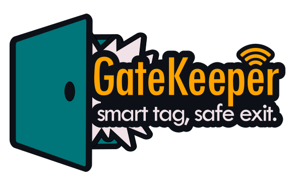

<div align="center">



# 🛡️ GateKeeper

### *Smart tag, safe exit*

> Sistema IoT domestico intelligente che traccia automaticamente chi entra ed esce di casa,
> quali oggetti porta con sé, e avvisa in caso di situazioni anomale —
> **senza tracking continuo**, basato su eventi.

<br/>

[](https://flutter.dev)
[](https://fastapi.tiangolo.com)
[](https://python.org)
[](https://raspberrypi.org)
[](LICENSE)

<!-- TODO: aggiungi il link alla documentazione hosted (es. GitHub Pages / ReadTheDocs) -->
[📖 Documentazione](https://scalabrimsimone.github.io/GateKeeper) &nbsp;·&nbsp;
<!-- TODO: aggiungi link alla demo video -->
[🎬 Demo](#) &nbsp;·&nbsp;
[🐛 Issues](https://github.com/ScalabrinSimone/GateKeeper/issues)

</div>

---

## 📸 Screenshot

<!-- TODO: inserisci screenshot dell'app (dashboard, lista oggetti, eventi) -->
> *Screenshot in arrivo — avvia l'app con `flutter run` per vederla in azione.*

---

## 💡 Cos'è GateKeeper?

GateKeeper è un sistema IoT open-source pensato per la casa.
Combina un lettore **RFID UHF** montato alla porta con il **Bluetooth Low Energy** del telefono
per sapere automaticamente chi è uscito con cosa — e notificarti solo quando serve.

**Non è un sistema di sorveglianza.** Non registra video, non traccia posizioni GPS, non
conserva dati sensibili. Si attiva solo quando qualcosa passa attraverso la porta.

<br/>

<div align="center">

| | Cosa rileva | Come |
|---|---|---|
| 🏷️ **Oggetti** | Chiavi, portafoglio, zaino, ombrello… | Tag RFID passivi (costo < 0.10€/tag) |
| 👤 **Persone** | Chi è uscito con gli oggetti | BLE del telefono registrato nell'app |
| 🚨 **Anomalie** | Oggetto uscito senza persona | Confronto RFID + BLE in tempo reale |
| 🔔 **Notifiche** | Alert contestuali | Email + notifiche locali nell'app |

</div>

---

## 🏗️ Architettura

```
┌─────────────────────────────────────────────────────────────────┐
│                        📱 Flutter App                           │
│   Dashboard · Oggetti · Eventi · Impostazioni · Profilo         │
└───────────────────────┬─────────────────────────────────────────┘
                        │ HTTPS (Cloudflare Tunnel)
┌───────────────────────▼─────────────────────────────────────────┐
│                   🧠 Raspberry Pi 4 — Hub                        │
│                                                                  │
│  ┌──────────────┐  ┌──────────────┐  ┌──────────────────────┐  │
│  │ FastAPI      │  │ RFID Reader  │  │  BLE Scanner         │  │
│  │ (REST API)   │  │ (thread)     │  │  (thread)            │  │
│  └──────┬───────┘  └──────┬───────┘  └──────────┬───────────┘  │
│         │                 │                      │              │
│  ┌──────▼─────────────────▼──────────────────────▼──────────┐  │
│  │              Event Engine                                 │  │
│  │  RFID tag → cerca device → BLE vicino → utente →          │  │
│  │  crea evento passage_in/out · aggiorna stato · notifica   │  │
│  └──────────────────────────┬─────────────────────────────┘  │
│                              │                                   │
│  ┌───────────────────────────▼──────────────────────────────┐  │
│  │           JSON NoSQL DB  (nosql_db.json)                 │  │
│  │  users · devices · events · logs · invites               │  │
│  └───────────────────────────────────────────────────────────┘  │
└─────────────────────────────────────────────────────────────────┘
```

---

## 🔧 Stack tecnologico

<div align="center">

<table>
<tr>
<td align="center" width="160">
<br/>
<b>Flutter</b><br/>
<sub>App mobile & desktop</sub>
</td>
<td align="center" width="160">
<br/>
<b>FastAPI</b><br/>
<sub>REST API backend</sub>
</td>
<td align="center" width="160">
<br/>
<b>Python 3.11+</b><br/>
<sub>Backend runtime</sub>
</td>
<td align="center" width="160">
<br/>
<b>Raspberry Pi 4</b><br/>
<sub>Hub IoT centrale</sub>
</td>
</tr>
<tr>
<td align="center">
<br/>
<b>Cloudflare Tunnel</b><br/>
<sub>Accesso remoto sicuro</sub>
</td>
<td align="center">
<br/>
<b>go_router</b><br/>
<sub>Navigazione Flutter</sub>
</td>
<td align="center">
<br/>
<b>MkDocs Material</b><br/>
<sub>Documentazione</sub>
</td>
<td align="center">
<br/>
<b>Fritzing</b><br/>
<sub>Schema elettrico</sub>
</td>
</tr>
</table>

</div>

---

## 📂 Struttura del progetto

```
GateKeeper/
├── 📱 app/                    # Flutter app (mobile, desktop, web)
│   └── lib/
│       ├── core/              # Theme, l10n, state, config
│       ├── data/              # API client, DTOs, repositories, services
│       ├── features/          # Una cartella per schermata
│       └── shared/            # Widget e modelli condivisi
│
├── 🧠 backend/                # FastAPI server (Raspberry Pi)
│   └── app/
│       ├── api/               # endpoint.py — tutte le route REST
│       ├── ble/               # Scanner Bluetooth Low Energy
│       ├── db/                # NoSQL JSON storage
│       ├── rfid/              # Lettore RFID UHF
│       ├── security/          # JWT, mailer, password
│       └── services/          # Event engine, discovery
│
├── 📖 docs/                   # Documentazione MkDocs Material
│   ├── index.md
│   ├── panoramica/
│   ├── parte-tecnica/
│   ├── guida-utente/
│   └── stylesheets/
│
├── 🎨 appTypescriptMockup/    # Mockup React (riferimento UI)
└── mkdocs.yml                 # Config documentazione
```

---

## 🚀 Quick Start

### Prerequisiti

- Python 3.11+ e pip
- Flutter 3.x e Dart SDK
- Raspberry Pi 4 (o PC per sviluppo locale)
- Lettore RFID UHF USB (CH340/CH910)

### 1 — Backend (Raspberry Pi / PC)

```bash
# Clona il repository
git clone https://github.com/ScalabrinSimone/GateKeeper.git
cd GateKeeper/backend

# Crea e attiva ambiente virtuale
python -m venv venv
source venv/bin/activate          # Linux/macOS
# oppure: venv\Scripts\activate   # Windows

# Installa dipendenze
pip install -r requirements.txt

# (Opzionale) Configura email reale
cp .env.example .env
# Modifica .env con le credenziali Gmail App Password

# Avvia il backend
python run_all.py
# → Stampa QR di pairing nel terminale
# → Avvia RFID + BLE automaticamente dopo il pairing
```

### 2 — App Flutter

```bash
cd GateKeeper/app

# Installa dipendenze Dart
flutter pub get

# Avvia (desktop/mobile/web)
flutter run
```

### 3 — Pairing

1. Apri l'app → scegli **"Nuovo hub"**
2. Scansiona il QR mostrato nel terminale del Raspberry
3. Crea il tuo account admin
4. Il sistema è pronto ✓

---

## 📡 API REST — Endpoint principali

| Metodo | Endpoint | Descrizione |
|--------|----------|-------------|
| `GET` | `/hub/info` | Stato hub (paired/unpaired) |
| `POST` | `/hub/pair` | Primo pairing + creazione admin |
| `POST` | `/auth/login` | Login (username o email) |
| `GET` | `/auth/me` | Utente corrente |
| `GET/POST` | `/devices` | Lista e creazione oggetti |
| `GET/POST` | `/events` | Cronologia eventi |
| `POST` | `/invites/accept` | Accetta invito come nuovo membro |
| `POST` | `/users/me/ble` | Registra indirizzo BLE del telefono |
| `GET` | `/ble/nearby` | Dispositivi BLE vicini al Raspberry |

> Documentazione completa: `http://localhost:8000/docs` (Swagger UI automatica)

---

## 🔔 Come funzionano le notifiche

```
RFID rileva tag ──► Event Engine verifica BLE vicini
                         │
              ┌──────────┴──────────┐
              │ Telefono registrato? │
              └──────────┬──────────┘
                   Sì ◄──┴──► No
                   │              │
             evento normale   ALERT 🚨
             passage_in/out   (possibile furto)
                   │              │
              notifica all'      notifica a
              utente associato   TUTTI gli utenti
```

---

## 👥 Team

<!-- TODO: aggiorna con i nomi e link GitHub del team -->

| Ruolo | Nome | GitHub |
|-------|------|--------|
| 🏗️ Lead / Backend / IoT | Simone Scalabrin | [@ScalabrinSimone](https://github.com/ScalabrinSimone) |
| 📱 Flutter App | — | — |
| 🔧 Hardware | — | — |

> **TODO:** aggiungi tutti i membri del team nella tabella sopra.

---

## 📄 Licenza

Distribuito sotto licenza **MIT**.
Vedi il file [`LICENSE`](LICENSE) per i dettagli.

<!-- TODO: crea il file LICENSE nella root se non ancora presente -->

---

<div align="center">

*Fatto con ❤️ e tanto caffè ☕ da IoTeam*

<!-- TODO: aggiungi link al Discord o altra community -->
[](https://discord.gg/jARTvAt8Kh)

</div>
