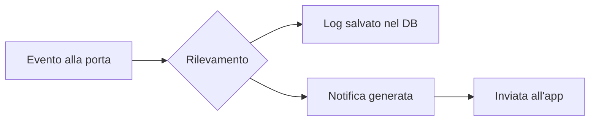

# 🔔 Notifiche

## Panoramica

Il sistema GateKeeper invia notifiche contestuali all'app quando si verificano eventi rilevanti alla porta di casa.

## Tipi di Evento

| Evento | Descrizione |
|---|---|
| `passage_in` | Oggetto o utente è entrato |
| `passage_out` | Oggetto o utente è uscito |
| `alert` | Situazione anomala rilevata |
| `system` | Evento di sistema (es. avvio, errore) |

## Quando Viene Inviata una Notifica

### Oggetti Essenziali Dimenticati

Se un utente esce senza un oggetto marcato come `is_essential: true`, il sistema può generare un alert.

| Situazione | Notifica |
|---|---|
| Esci senza ombrello con pioggia prevista | ☔ "Hai dimenticato l'ombrello!" |
| Un bambino esce senza supervisione | 👶 "Bambino uscito senza adulti" |
| Oggetto sensibile dimenticato | 🔒 "Ti sei scordato di prendere {oggetto}" |

### Transiti non Riconosciuti

- Oggetto senza proprietario associato che attraversa la porta
- Utente non riconosciuto dal BLE

## Come Funziona



1. **Rilevamento**: RFID e BLE captano il transito alla porta
2. **Associazione**: il backend collega utente e oggetti all'evento tramite le API
3. **Decisione**: in base alle `alert_rules` dell'oggetto e al ruolo dell'utente
4. **Notifica**: l'evento viene registrato e reso disponibile all'app

## Stato Attuale

> ⚠️ Le notifiche sono attualmente in fase di sviluppo. Il backend registra correttamente gli eventi nel database, ma l'invio di notifiche push all'app (FCM/APNs) non è ancora implementato.

## API per le Notifiche

### Creare un Evento di Test

```bash
curl -X POST http://localhost:8000/events \
  -H "Content-Type: application/json" \
  -d '{
    "user_id": 1,
    "event_type": "alert",
    "direction": "out",
    "detected_objects": "[{\"name\": \"Ombrello\"}]"
  }'
```

### Lista Eventi

```bash
curl http://localhost:8000/events
```

### Filtri

```bash
# Eventi per utente
curl "http://localhost:8000/events?user_id=1"

# Eventi per tipo
curl "http://localhost:8000/events?event_type=alert"
```

## Piani Futuri

- Integrazione con **Firebase Cloud Messaging** per notifiche push
- Notifiche in tempo reale via **WebSocket** o **Server-Sent Events**
- Personalizzazione delle regole di notifica dall'app
- Storico notifiche consultabile
