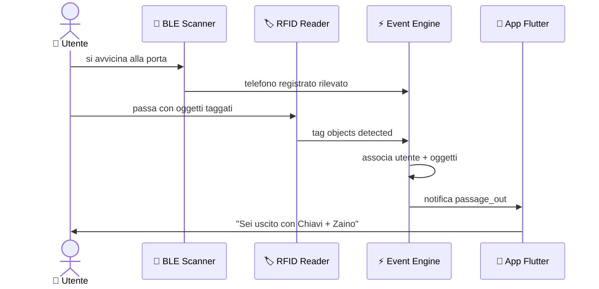

---
hide:
  - navigation
  - toc
---

IoT · RFID · BLE · Flutter · Raspberry Pi

🛡️ Smart Home Security

# GateKeeper

Sistema IoT domestico intelligente che traccia automaticamente chi entra ed esce di casa, 
quali oggetti porta con sé — e notifica <strong>solo quando serve</strong>. 
<em>Senza tracking continuo. Senza cloud obbligatorio. Solo eventi.</em>

[Scopri l'architettura](panoramica/architettura.md){ .md-button }
[Inizia subito](guida-utente/ricreare-progetto.md){ .md-button .md-button--secondary }

---

RFID
Tag passivi UHF

BLE
Rilevamento utenti

JWT
Auth sicura

0
Cloud obbligatori

---

## Come funziona

---

## I tre pilastri

-   📡 __RFID UHF__

    ---

    Ogni oggetto di casa porta un tag passivo RFID UHF (costo < 0,10€).
    Il lettore alla porta rileva automaticamente cosa entra e cosa esce —
    senza batterie, senza manutenzione.

    [Hardware →](parte-tecnica/hardware.md)

-   📶 __Bluetooth Low Energy__

    ---

    Il Raspberry Pi rileva il telefono dell'utente tramite BLE.
    Una volta registrato nell'app, il sistema sa chi è presente alla porta
    e associa l'evento all'utente corretto.

    [Event Engine →](parte-tecnica/backend.md)

-   🔒 __Accesso sicuro ovunque__

    ---

    Cloudflare Tunnel garantisce accesso remoto cifrato
    senza esporre il Raspberry Pi su Internet e senza
    configurare nulla sul router.

    [Sicurezza →](parte-tecnica/sicurezza.md)

---

## Stack tecnologico

-   🧠 __Raspberry Pi 4__

    ---

    Hub centrale del sistema. Esegue FastAPI, RFID reader, BLE scanner
    e l'Event Engine — tutto in Python 3.11+.

-   ⚙️ __FastAPI + Python__

    ---

    API REST con autenticazione JWT, database JSON NoSQL locale,
    supporto BLE/RFID in thread separati e mailer SMTP.

-   📱 __Flutter__

    ---

    App cross-platform (Android, iOS, macOS, Windows, Web).
    Real-time via `RealtimeService`, tema dark/light,
    animazioni fluide e feedback aptico.

-   📊 __MkDocs Material__

    ---

    Questa stessa documentazione — costruita con MkDocs Material,
    tema personalizzato GateKeeper, animazioni scroll e diagrammi Mermaid.

---

## Esplora la documentazione

-   🗺️ __Panoramica__

    ---

    Idea, architettura generale e componenti del sistema.

    [Vai →](panoramica/idea.md)

-   🔧 __Parte Tecnica__

    ---

    Backend, database, hardware, app Flutter e sicurezza.

    [Vai →](parte-tecnica/backend.md)

-   📖 __Guida Utente__

    ---

    Installazione, primo avvio e come ricreare il progetto da zero.

    [Vai →](guida-utente/installazione.md)

-   🚀 __Sviluppo__

    ---

    Roadmap, team workflow e come contribuire al progetto open source.

    [Vai →](sviluppo/workflow.md)

-   🐛 __Problemi & Soluzioni__

    ---

    Sfide tecniche incontrate durante lo sviluppo e le soluzioni adottate.

    [Vai →](problemi/index.md)

