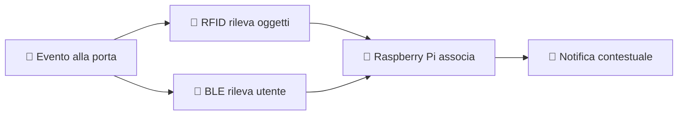

# 🛡️ GateKeeper

## Smart tag, safe exit

> Sistema IoT domestico intelligente che traccia oggetti e utenti
> alla porta di casa — automaticamente, senza tracking continuo.

[Scopri il progetto](panoramica/idea.md){ .md-button }
[Architettura](panoramica/architettura.md){ .md-button }

---

## Come funziona

**In tre passi:**

1. **Rileva** — RFID e BLE captano il transito alla porta
2. **Associa** — il sistema collega utente e oggetti all'evento
3. **Notifica** — l'app invia un alert solo se necessario

---

## I tre pilastri

-   📡 __RFID UHF__

    ---

    Ogni oggetto è dotato di un tag passivo.
    Il lettore alla porta rileva automaticamente
    cosa entra e cosa esce.

-   📶 __Bluetooth Low Energy__

    ---

    Il sistema riconosce chi è presente
    nei pressi della porta tramite
    il telefono dell'utente.

-   🔒 __Accesso sicuro__

    ---

    Cloudflare Tunnel garantisce accesso
    remoto cifrato senza esporre
    il Raspberry Pi su Internet.

---

## Stack tecnologico

| Componente | Tecnologia |
|---|---|
| 🧠 Hub centrale | Raspberry Pi 4 |
| ⚙️ Backend | FastAPI + Python 3.11+ |
| 🗄️ Database | SQLite → PostgreSQL |
| 📱 App | Flet |
| 🌐 Accesso remoto | Cloudflare Tunnel |

---

## Esplora la documentazione

-   🗺️ __Panoramica__

    ---

    Idea, architettura generale e componenti del sistema.

    [Vai →](panoramica/idea.md)

-   📖 __Guida utente__

    ---

    Installazione, primo avvio e gestione delle notifiche.

    [Vai →](guida-utente/installazione.md)

-   🔧 __Parte tecnica__

    ---

    Backend, database, hardware e sicurezza.

    [Vai →](parte-tecnica/backend.md)

-   🚀 __Sviluppo__

    ---

    Roadmap e come contribuire al progetto.

    [Vai →](sviluppo/roadmap.md)

