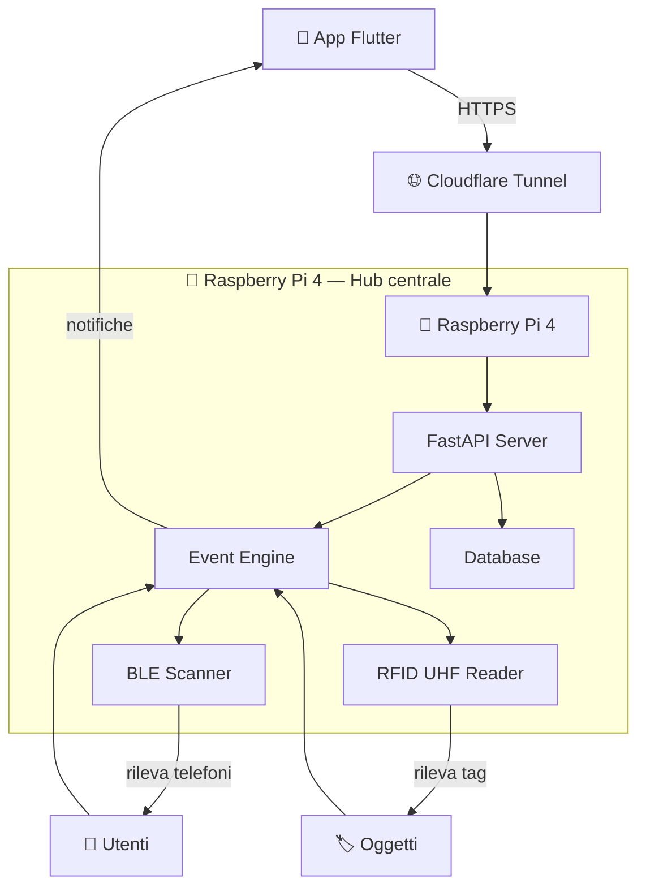
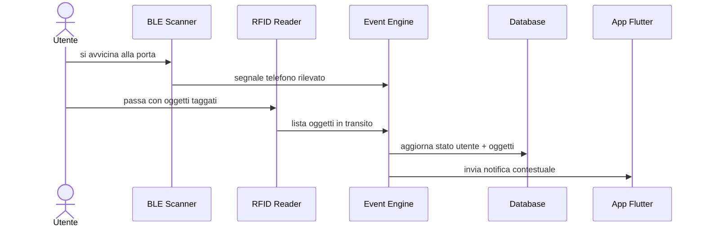

# 🏗️ Architettura

## Visione generale

GateKeeper è strutturato attorno a un **hub centrale** (Raspberry Pi 4)
che coordina sensori hardware, logica applicativa e comunicazione con l'app utente.
Tutti i componenti comunicano attraverso API interne, senza esporre direttamente
nessun servizio su Internet.

---

## Schema architetturale

---

## Flusso di un evento tipico

---

## Livelli del sistema

| Livello | Componente | Responsabilità |
|---|---|---|
| **Hardware** | RFID UHF + BLE | Rilevamento fisico eventi |
| **Hub** | Raspberry Pi 4 | Coordinamento e logica |
| **Backend** | FastAPI | API, autenticazione, DB |
| **Accesso** | Cloudflare Tunnel | Connettività remota sicura |
| **Frontend** | App Flutter | Interfaccia utente |

---

## Principi di design

- **Event-driven**: nessun polling continuo, il sistema reagisce agli eventi
- **Privacy-first**: nessun dato esce dalla rete locale, solo notifiche cifrate
- **Modulare**: ogni componente è sostituibile indipendentemente
- **Offline-resilient**: il Raspberry Pi funziona anche senza connessione remota