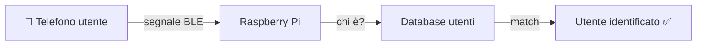
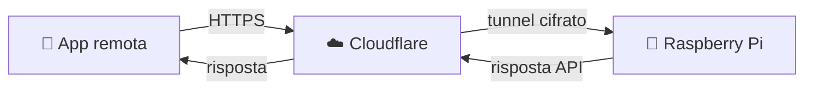

# 🔧 Componenti

## Panoramica

GateKeeper è composto da cinque componenti principali che collaborano
per formare un sistema coerente ed event-driven.

---

## Raspberry Pi 4

Il **cervello del sistema**. Tutti gli altri componenti fanno riferimento a lui
per elaborazione, storage e decisioni logiche.

| Caratteristica | Dettaglio |
|---|---|
| Ruolo | Hub centrale |
| Connettività | Wi-Fi, Ethernet, BLE integrato |
| Software | FastAPI, Event Engine, DB |
| Alimentazione | Continua (consigliato UPS) |

**Responsabilità principali:**

- gestione utenti e sessioni
- raccolta e correlazione eventi RFID + BLE
- esecuzione della logica smart home
- comunicazione con l'app tramite API

---

## RFID UHF Reader

Il sensore posizionato **alla porta** per rilevare il transito degli oggetti taggati.

| Caratteristica | Dettaglio |
|---|---|
| Tecnologia | UHF (Ultra High Frequency) |
| Raggio di lettura | fino a ~2 metri |
| Direzione | rileva IN / OUT |
| Tag supportati | passivi UHF standard |

> 💡 Ogni oggetto domestico (chiavi, ombrello, zaino, ecc.) viene dotato
> di un piccolo tag RFID adesivo per essere tracciato automaticamente.

---

## BLE Scanner

Sfrutta il **Bluetooth Low Energy integrato** nel Raspberry Pi per rilevare
i telefoni degli utenti nelle vicinanze della porta.

| Caratteristica | Dettaglio |
|---|---|
| Tecnologia | Bluetooth Low Energy |
| Scopo | identificare l'utente presente |
| Raggio | ~5-10 metri configurabile |
| Richiede | app installata sul telefono |

**Come funziona:**

---

## App Flet

L'interfaccia utente del sistema, sviluppata in **Python con Flet**,
disponibile su mobile e desktop.

| Funzione | Descrizione |
|---|---|
| Dashboard | stato in tempo reale di utenti e oggetti |
| Notifiche | alert contestuali sugli eventi |
| Gestione utenti | aggiunta/rimozione membri e ruoli |
| Gestione oggetti | associazione tag RFID agli oggetti |
| Setup iniziale | configurazione casa e dispositivi |

**Ruoli supportati:**

| Ruolo | Permessi |
|---|---|
| 👑 Admin | accesso completo, gestione casa |
| 👤 Adulto | visualizzazione e notifiche |
| 👶 Bambino | accesso limitato, monitoraggio da admin |

---

## Cloudflare Tunnel

Garantisce l'**accesso remoto sicuro** all'hub senza esporre il Raspberry Pi
direttamente su Internet.

| Caratteristica | Dettaglio |
|---|---|
| Protocollo | HTTPS cifrato |
| VPN richiesta | ❌ No |
| Configurazione router | ❌ No (nessun port forwarding) |
| Autenticazione | JWT + tunnel token |

> 🔒 Il Raspberry Pi non è mai raggiungibile direttamente dall'esterno:
> tutto il traffico passa attraverso Cloudflare, che fa da proxy sicuro.

---

## Database

Archivia lo **stato persistente** del sistema.

| Entità | Contenuto |
|---|---|
| `users` | utenti, ruoli, dispositivi BLE associati |
| `objects` | oggetti, tag RFID, proprietario |
| `events` | storico entrate/uscite con timestamp |
| `home_state` | stato attuale di utenti e oggetti |

> In fase iniziale si utilizza **SQLite** per semplicità.
> L'architettura supporta migrazione a **PostgreSQL** per deploy più robusti.