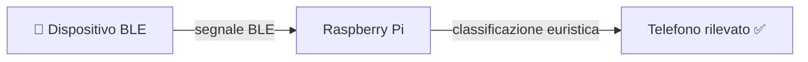
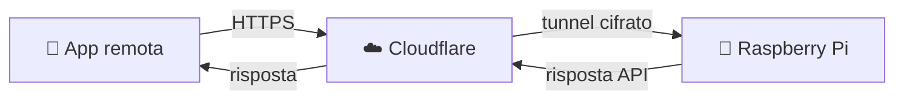

# 🔧 Componenti

## Panoramica

GateKeeper è composto da cinque componenti principali che collaborano
per formare un sistema coerente ed event-driven.

---

## Raspberry Pi 4

Il **cervello del sistema**. Tutti gli altri componenti fanno riferimento a lui
per elaborazione, storage e decisioni logiche.

| Caratteristica | Dettaglio |
|---|---|
| Ruolo | Hub centrale |
| Connettività | Wi-Fi, Ethernet, BLE integrato |
| Software | FastAPI, JSON NoSQL DB |
| Alimentazione | Continua (consigliato UPS) |

**Responsabilità principali:**

- gestione utenti e sessioni
- raccolta e correlazione eventi RFID + BLE
- esecuzione della logica smart home
- comunicazione con l'app tramite API

---

## RFID UHF Reader

Il sensore posizionato **alla porta** per rilevare il transito degli oggetti taggati.

| Caratteristica | Dettaglio |
|---|---|
| Tecnologia | UHF (Ultra High Frequency) |
| Raggio di lettura | fino a ~2 metri |
| Direzione | rileva IN / OUT |
| Tag supportati | passivi UHF standard |

> 💡 Ogni oggetto domestico (chiavi, ombrello, zaino, ecc.) viene dotato
> di un piccolo tag RFID adesivo per essere tracciato automaticamente.

---

## BLE Scanner

Sfrutta il **Bluetooth Low Energy integrato** nel Raspberry Pi per rilevare
i telefoni nelle vicinanze della porta.

| Caratteristica | Dettaglio |
|---|---|
| Tecnologia | Bluetooth Low Energy |
| Scopo | rilevare presenza dispositivi BLE |
| Raggio | ~5-10 metri |
| Libreria | bleak 3.0.2 |

**Come funziona:**

> ⚠️ Lo scanner BLE attualmente rileva e classifica i dispositivi ma **non identifica** l'utente specifico. L'associazione telefono-utente è prevista in una fase futura.

---

## App Flutter

L'interfaccia utente del sistema, sviluppata in **Flutter (Dart)**,
disponibile su mobile, desktop e web.

| Funzione | Descrizione |
|---|---|
| Dashboard | monitoraggio presenze e statistiche |
| Eventi | cronologia entrate/uscite con filtri |
| Utenti | gestione membri e ruoli per colonna |
| Oggetti | griglia oggetti RFID con filtri per categoria |
| Impostazioni | tema, lingua, notifiche, sicurezza |
| Account | profilo, cambio password, preferenze |
| Setup | configurazione guidata primo avvio |

**Tecnologie utilizzate:**

| Componente | Libreria |
|---|---|
| State management | Provider (ChangeNotifier) |
| Routing | go_router 17.x |
| Internazionalizzazione | flutter_localizations + intl |
| Animazioni | flutter_animate |
| Icone | flutter_svg |
| Feedback aptico | vibration |

> ⚠️ L'app al momento utilizza **dati mock** (hardcoded). Il collegamento con il backend API reale è in fase di sviluppo.

**Ruoli supportati:**

| Ruolo | Permessi |
|---|---|
| 👑 Admin | accesso completo, gestione casa |
| 👤 Adulto | visualizzazione e notifiche |
| 👶 Bambino | accesso limitato, monitoraggio da admin |

---

## Cloudflare Tunnel

Garantisce l'**accesso remoto sicuro** all'hub senza esporre il Raspberry Pi
direttamente su Internet.

| Caratteristica | Dettaglio |
|---|---|
| Protocollo | HTTPS cifrato |
| VPN richiesta | ❌ No |
| Configurazione router | ❌ No (nessun port forwarding) |
| Autenticazione | Tunnel token (JWT in futuro) |

> 🔒 Il Raspberry Pi non è mai raggiungibile direttamente dall'esterno:
> tutto il traffico passa attraverso Cloudflare, che fa da proxy sicuro.

---

## Database

Archivia lo **stato persistente** del sistema in un file **JSON NoSQL**.

| Collezione | Contenuto |
|---|---|
| `users` | utenti, ruoli, hash password, UUID BLE |
| `devices` | oggetti, tag RFID, categoria, stato |
| `user_devices` | associazioni molti-a-molti utente ↔ dispositivo |
| `logs` | storico entrate/uscite con timestamp |
| `events` | eventi di sistema (passaggi, alert) |

> Il database è un file **JSON** (`backend/app/db/nosql_db.json`) con accesso thread-safe tramite `threading.RLock`. Scritture atomiche via `.tmp` + `os.replace()`.
>
> L'architettura è progettata per supportare una futura migrazione a **PostgreSQL**, ma al momento rimane su JSON per semplicità di deploy su Raspberry Pi.