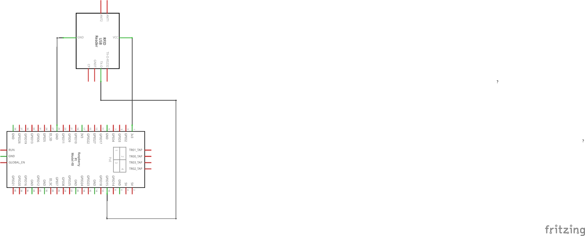
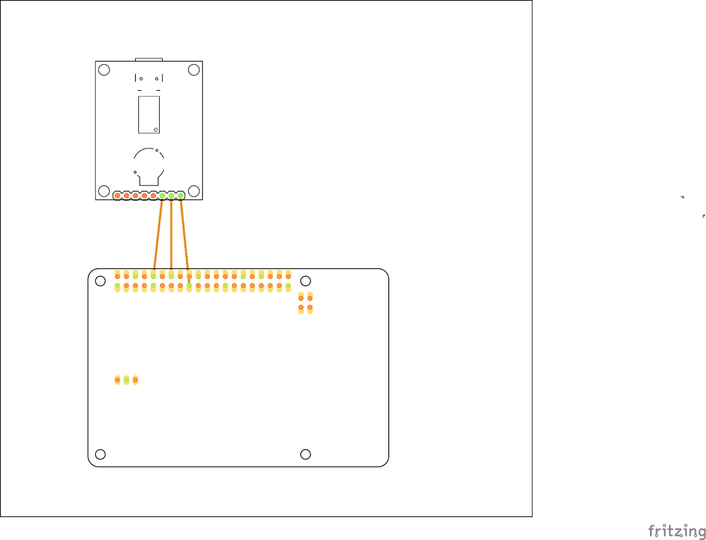
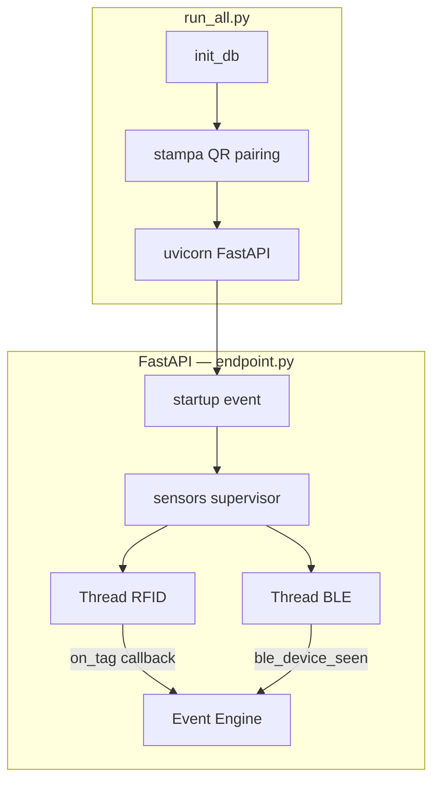

# 🧩 Hardware & Circuito

## Panoramica

GateKeeper si basa su **Raspberry Pi 4** come hub centrale, con due sensori principali:
un lettore **RFID UHF** per gli oggetti e lo scanner **BLE integrato** per gli utenti.

---

## Raspberry Pi 4

| Caratteristica | Dettaglio |
|---|---|
| Ruolo | Hub centrale del sistema |
| CPU | Quad-core Cortex-A72 (ARM v8) 64-bit |
| RAM consigliata | 4 GB |
| Connettività | Wi-Fi, Ethernet, BLE integrato |
| SO consigliato | Raspberry Pi OS Lite 64-bit / Ubuntu Server 22.04 |
| Alimentazione | 5V / 3A via USB-C |

---

## Lettore RFID UHF

| Parametro | Valore |
|---|---|
| Tecnologia | UHF 860–960 MHz |
| Baudrate | 38400 bps |
| Connessione | USB → seriale (CH340) |
| Portata | ~1-2 m (regolabile) |
| Tag supportati | EPC Gen2 / ISO 18000-6C |

---

## Schema elettrico

**Connessioni:**

| Componente | Pin RFID Reader | Raspberry Pi |
|---|---|---|
| Alimentazione | VCC | 5V (Pin 2 o 4) |
| GND | GND | GND (Pin 6) |
| Dati | TX/RX via CH340 | Porta USB |

---

## Schema PCB

!!! tip "Ordinare la PCB"
    Usa **JLCPCB** o **PCBWay** con i file Gerber. Costo: ~5€ per 5 pezzi.

---

## Modelli 3D stampabili

Struttura fisica progettata per stampa FDM (PLA/PETG).
Usa il **mouse per ruotare**, lo **scroll per zoom**, **tasto centrale per spostare**.

### 📡 Case Sensore RFID

  <canvas data-stl="../modelli3D/RFID%20Sensore%20Case/YRM1002%20Case.stl"></canvas>
  
📡 Case Sensore RFID — YRM1002

  
Montaggio a parete / porta

  

    <a href="../modelli3D/RFID%20Sensore%20Case/YRM1002%20Case.stl" download class="md-button md-button--secondary" style="font-size:0.75rem;padding:0.3em 0.9em">⬇ STL</a>
  

---

### 🧠 Case Raspberry Pi 4 (NR200P Style)

  <canvas data-stl="../modelli3D/Raspberry%20Pi%204%20Case/obj_3_Case%20Body%20-%20NR200P%20-%20Pi%204.stl"></canvas>
  
🧠 Corpo Principale

  
Case Body — NR200P Pi 4

  

    <a href="../modelli3D/Raspberry%20Pi%204%20Case/obj_3_Case%20Body%20-%20NR200P%20-%20Pi%204.stl" download class="md-button md-button--secondary" style="font-size:0.75rem;padding:0.3em 0.9em">⬇ STL</a>
  

  <canvas data-stl="../modelli3D/Raspberry%20Pi%204%20Case/obj_6_Front%20Plate%20-%20NR200P.stl"></canvas>
  
🔲 Pannello Frontale

  
Front Plate — NR200P

  

    <a href="../modelli3D/Raspberry%20Pi%204%20Case/obj_6_Front%20Plate%20-%20NR200P.stl" download class="md-button md-button--secondary" style="font-size:0.75rem;padding:0.3em 0.9em">⬇ STL</a>
  

  <canvas data-stl="../modelli3D/Raspberry%20Pi%204%20Case/obj_2_Rear%20Hatch%20-%20NR200P%20-%20Pi%204.stl"></canvas>
  
🔲 Pannello Posteriore

  
Rear Hatch — NR200P Pi 4

  

    <a href="../modelli3D/Raspberry%20Pi%204%20Case/obj_2_Rear%20Hatch%20-%20NR200P%20-%20Pi%204.stl" download class="md-button md-button--secondary" style="font-size:0.75rem;padding:0.3em 0.9em">⬇ STL</a>
  

---

### 🔲 Pannello laterale — scegli il tipo

!!! info "Scegli"
    Hai due opzioni per il pannello laterale — la scelta è **puramente estetica**.
    Entrambe si montano allo stesso modo **ad incastro** nel corpo del case.

  <canvas data-stl="../modelli3D/Raspberry%20Pi%204%20Case/obj_14_Transparent+Side+Panel+-+For+all+Raspberry+Pi+Case+-+NR200P.stl"></canvas>
  
🔲 Pannello Laterale Forato

  
Estetica tecnica — migliore ventilazione passiva

  

    <a href="../modelli3D/Raspberry%20Pi%204%20Case/obj_14_Transparent+Side+Panel+-+For+all+Raspberry+Pi+Case+-+NR200P.stl" download class="md-button md-button--secondary" style="font-size:0.75rem;padding:0.3em 0.9em">⬇ STL</a>
  

  <canvas data-stl="../modelli3D/Raspberry%20Pi%204%20Case/obj_8_NR200P%20-%20Side%20Pane.stl"></canvas>
  
🔲 Pannello Laterale Pieno

  
Estetica minimalista — nessuna ventilazione visibile

  

    <a href="../modelli3D/Raspberry%20Pi%204%20Case/obj_8_NR200P%20-%20Side%20Pane.stl" download class="md-button md-button--secondary" style="font-size:0.75rem;padding:0.3em 0.9em">⬇ STL</a>
  

---

### 💾 Accesso MicroSD

  <canvas data-stl="../modelli3D/Raspberry%20Pi%204%20Case/obj_5_SD%20Card%20Access%20-%20NR200P.stl"></canvas>
  
💾 Accesso MicroSD

  
SD Card Access — NR200P

  

    <a href="../modelli3D/Raspberry%20Pi%204%20Case/obj_5_SD%20Card%20Access%20-%20NR200P.stl" download class="md-button md-button--secondary" style="font-size:0.75rem;padding:0.3em 0.9em">⬇ STL</a>
  

---

### 🦶 Piedini e gommini

  <canvas data-stl="../modelli3D/Raspberry%20Pi%204%20Case/obj_1_Foot%20-%20NR200P.stl"></canvas>
  
🦶 Piedino — PLA/PETG

  
Struttura rigida, montaggio ad incastro nel case

  

    <a href="../modelli3D/Raspberry%20Pi%204%20Case/obj_1_Foot%20-%20NR200P.stl" download class="md-button md-button--secondary" style="font-size:0.75rem;padding:0.3em 0.9em">⬇ STL</a>
  

  <canvas data-stl="../modelli3D/Raspberry%20Pi%204%20Case/obj_4_Foot%20TPU%20Grip%20-%20NR200P.stl"></canvas>
  
🦶 Gommino Piedino — TPU

  
Antiscivolo flessibile, da incollare al piedino con colla a caldo

  

    <a href="../modelli3D/Raspberry%20Pi%204%20Case/obj_4_Foot%20TPU%20Grip%20-%20NR200P.stl" download class="md-button md-button--secondary" style="font-size:0.75rem;padding:0.3em 0.9em">⬇ STL</a>
  

!!! tip "Note di montaggio"
    - **Gommini (TPU)**: stampa con **filamento TPU flessibile** a temperature più basse del PLA (~210-220°C vs 200-215°C PLA). Incollali ai piedini rigidi con **colla a caldo**.
    - **Pannello laterale**: montaggio **ad incastro** nel corpo — nessuna colla necessaria. Scegli tra pieno e forato in base alla preferenza estetica.
    - **Case e corpo principale**: montaggio ad incastro. La colla non è necessaria e rende difficile smontare in futuro.

---

## Architettura dei Thread

---

## Lista della spesa (BOM)

| Componente | Qtà | Costo stimato |
|---|---|---|
| Raspberry Pi 4 (4GB) | 1 | ~60€ |
| Lettore RFID UHF USB | 1 | ~30-80€ |
| Tag RFID UHF (100 pz) | 1 pack | ~8-15€ |
| MicroSD 32GB Classe 10 | 1 | ~8€ |
| Alimentatore USB-C 5V/3A | 1 | ~10€ |
| Filamento PLA/PETG (case) | ~200g | ~5€ |
| Filamento TPU (gommini) | ~50g | ~3€ |

<!-- TODO: aggiungi i link diretti ai prodotti utilizzati -->
**Totale stimato: ~125-185€**
