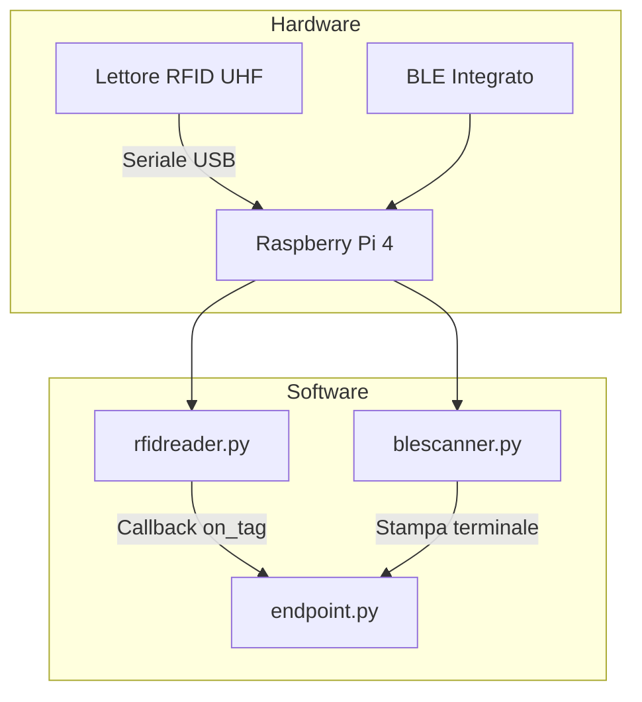

# 🧩 Hardware

## Panoramica

GateKeeper si basa su **Raspberry Pi 4** come hub centrale, con due sensori principali per il rilevamento di oggetti e utenti.

## Raspberry Pi 4

| Caratteristica | Dettaglio |
|---|---|
| Ruolo | Hub centrale del sistema |
| CPU | Quad-core Cortex-A72 (ARM v8) |
| RAM | 2/4/8 GB |
| Connettività | Wi-Fi, Ethernet, BLE integrato |
| SO consigliato | Raspberry Pi OS Lite / Ubuntu Server |

## RFID UHF Reader

Il lettore RFID UHF è il sensore principale per il rilevamento degli oggetti.

### Specifiche Tecniche

| Parametro | Valore |
|---|---|
| Tecnologia | UHF (Ultra High Frequency) |
| Baudrate | 38400 |
| Connessione | Seriale (USB-to-serial) |
| Chipset | CH340 / CH910 compatibile |
| Potenza RF | Configurabile (default: 1B) |
| Rilevamento | Tag passivi UHF |

### Caratteristiche Software

Il modulo `backend/app/rfid/rfidreader.py` offre:

- **Lettura continua** dei tag RFID in un thread separato
- **Polling configurabile** per bilanciare frequenza e carico CPU
- **Potenza RF regolabile** per adattare il raggio di lettura
- **Timeout seriale configurabile**
- **Modalità "solo tag unici"** per evitare duplicati nelle letture ravvicinate
- **Callback personalizzabile** `on_tag(tag)` per integrazione con il backend
- **Auto-rilevamento porta** tramite `portfinder.py`

### Porta Seriale

Il modulo `portfinder.py` rileva automaticamente la porta seriale:
1. Cerca chipset **CH340/CH910** (comuni nei lettori RFID USB)
2. Fallback su **COM3** (Windows) / `/dev/ttyUSB0` (Linux)
3. Supporto per **WSL** (Windows Subsystem for Linux)

### Modalità di Utilizzo

- **Standalone**: esecuzione diretta per test
- **Thread**: integrato nel server FastAPI
- **API**: gestito tramite gli hook `startup`/`shutdown` di FastAPI

## BLE Scanner

Lo scanner Bluetooth Low Energy rileva la presenza di telefoni nelle vicinanze della porta.

### Specifiche Tecniche

| Parametro | Valore |
|---|---|
| Tecnologia | Bluetooth Low Energy (BLE) |
| Libreria | bleak 3.0.2 |
| Rilevamento | Dispositivi BLE in advertisement |
| Classificazione | Euristica basata su nome e dati advertisement |
| Thread | Separato, avviato prima del server API |

### Caratteristiche Software

Il modulo `backend/app/ble/blescanner.py` offre:

- **Scansione BLE continua** in background
- **Classificazione euristica**: identifica i dispositivi che sembrano telefoni basandosi su:
  - Nome del dispositivo
  - Indizi tipici delle advertisement BLE
- **Output terminale** elegante con dispositivi rilevati in tempo reale
- **Thread dedicato** gestito da `run_all.py`

### Limitazioni Note

> Il BLE non consente di identificare in modo certo una persona. Questo scanner rileva i dispositivi vicini che trasmettono advertisement BLE ed evidenzia quelli che sembrano telefoni. È pensato come base per una futura integrazione applicativa con associazione utente-dispositivo.

## Architettura dei Thread

```
run_all.py
    ├── init_db()                         # Inizializzazione database
    ├── startBleThread()                  # Avvio scanner BLE
    │   └── blescanner.runScanner()       # Thread BLE (daemon)
    └── uvicorn.run()                     # Avvio server FastAPI
        └── endpoint.py
            ├── startup event             # Avvio thread RFID
            │   └── rfidreader.start()    # Thread RFID (daemon)
            ├── API endpoints             # Richieste HTTP
            └── shutdown event            # Arresto thread RFID
```

## Schema di Collegamento


