# 🛠️ Team Workflow & Tooling

Questa pagina descrive il flusso di lavoro adottato dal team GateKeeper:
comunicazione, brainstorming, gestione progetto, Git e documentazione.

---

## Flusso completo

```mermaid
graph LR
    A[💡 Idea] --> B[GitHub Issue]
    B --> C[Discord - discussione]
    C --> D[Miro - brainstorming]
    D --> E[GitHub Projects - task]
    E --> F[feature branch]
    F --> G[sviluppo + docs]
    G --> H[Pull Request]
    H --> I[review + merge]
    I --> J[🚀 deploy docs automatico]
```



---

## 💬 Comunicazione — Discord

Il server Discord è il centro di comunicazione del team.

<!-- TODO: aggiorna il link di invito al server Discord -->
[Unisciti al server](https://discord.gg/jARTvAt8Kh){ .md-button }

### Struttura canali consigliata

| Canale | Uso |
|--------|-----|
| `#general` | Comunicazione generale |
| `#dev-backend` | Sviluppo backend Python/FastAPI |
| `#dev-app` | Sviluppo app Flutter |
| `#docs` | Documentazione MkDocs |
| `#meeting` | Organizzazione riunioni |
| `#dev-log` | Log automatico GitHub (bot) |

### Bot utili

| Bot | Funzione |
|-----|----------|
| **GitHub Integration** | Notifiche commit, PR, issue |
| **Sesh** | Pianificazione meeting e sprint |
| **Carl-bot** | Gestione ruoli, automazioni |

---

## 🧠 Brainstorming — Miro

[Miro](https://miro.com) è la lavagna collaborativa usata per:

- Architettura del sistema
- Flussi logici (RFID → Event Engine → Notifica)
- Brainstorming funzionalità
- Diagrammi e wireframe UI

### Board nel progetto

<!-- TODO: aggiungi i link alle board Miro del team -->
| Board | Link |
|-------|------|
| System Architecture | *(TODO: link Miro)* |
| User Flow | *(TODO: link Miro)* |
| RFID/BLE Logic | *(TODO: link Miro)* |
| Database Schema | *(TODO: link Miro)* |
| UI Wireframe | *(TODO: link Miro)* |

!!! tip "Integrazione con la docs"
    Esporta le immagini Miro come PNG e inseriscile in `docs/assets/`
    per averle sempre disponibili nella documentazione.

---

## 📋 Project Management — GitHub Projects

GitHub Projects è il kanban integrato nel repository.

<!-- TODO: aggiungi il link al GitHub Project del team -->

### Struttura board

| Colonna | Descrizione |
|---------|-------------|
| **Backlog** | Idee e task futuri |
| **To Do** | Task pronti da iniziare |
| **In Progress** | In sviluppo attivo |
| **Review** | In revisione (PR aperta) |
| **Done** | Completato |

### Labels GitHub

| Label | Uso |
|-------|-----|
| `backend` | Modifiche al backend Python |
| `frontend` | Modifiche all'app Flutter |
| `docs` | Documentazione |
| `bug` | Bug da correggere |
| `feature` | Nuova funzionalità |
| `research` | Ricerca/analisi |
| `hardware` | Componenti fisici |

---

## 🌿 Git Workflow

### Branch principali

| Branch | Scopo |
|--------|-------|
| `main` | Versione stabile — deploy docs automatico |
| `dev` | Integrazione sviluppo |
| `feature/*` | Sviluppo singola feature |

### Ciclo di vita di una feature

=== "1. Crea il branch"
    ```bash
    git checkout dev
    git pull origin dev
    git checkout -b feature/nome-feature
    ```

=== "2. Sviluppa"
    ```bash
    # Codice + documentazione nello stesso branch
    # Commit frequenti e descrittivi
    git add .
    git commit -m "feat: descrizione della modifica"
    ```

=== "3. Push e PR"
    ```bash
    git push origin feature/nome-feature
    # Apri Pull Request su GitHub verso dev
    ```

=== "4. Merge e cleanup"
    ```bash
    # Dopo l'approvazione della PR:
    # merge su dev (GitHub UI)
    # elimina il branch feature
    git branch -d feature/nome-feature
    ```

### Esempi di branch

```
feature/login-page
feature/rfid-event-engine
feature/ble-registration
feature/docs-hardware
fix/email-smtp-loading
```

### Regole importanti

!!! warning "Non lavorare mai direttamente su `main`"
    `main` riceve solo merge da `dev` tramite Pull Request.
    I commit diretti su `main` sono bloccati.

- **Feature piccole** — un branch, una funzionalità
- **Merge frequenti** — non lasciare branch aperti per settimane
- **Documentazione aggiornata** nello stesso branch del codice

---

## 🚀 Deploy Automatico Docs (GitHub Actions)

La documentazione viene pubblicata su **GitHub Pages** automaticamente
ad ogni push su `main` tramite GitHub Actions.

**File:** `.github/workflows/mkdocs.yml`

```yaml
name: Deploy MkDocs
on:
  push:
    branches:
      - main
jobs:
  deploy:
    runs-on: ubuntu-latest
    steps:
      - uses: actions/checkout@v4
      - uses: actions/setup-python@v5
        with: { python-version: '3.x' }
      - run: pip install mkdocs-material mkdocs-minify-plugin
      - run: mkdocs gh-deploy --force
```

**Come funziona:**

1. Push su `main` (o merge di PR)
2. GitHub Action si avvia automaticamente
3. Genera il sito statico con `mkdocs build`
4. Pubblica su GitHub Pages (branch `gh-pages`)

---

## 📚 Test locale della documentazione

Per vedere la documentazione in anteprima durante lo sviluppo:

```bash
# Dalla root del repository GateKeeper/
mkdocs serve
```

Poi apri nel browser: **http://127.0.0.1:8000**

Il server si aggiorna automaticamente ad ogni salvataggio dei file `.md`.

### Altri comandi utili

```bash
# Build statica (genera la cartella site/)
mkdocs build

# Build con controllo strict (avvisa su link rotti)
mkdocs build --strict

# Aggiorna i pacchetti
pip install --upgrade mkdocs-material mkdocs-minify-plugin
```

---

## 🎯 Principi del team

| Principio | Applicazione pratica |
|-----------|---------------------|
| **Semplicità prima** | Funziona → poi si ottimizza |
| **Docs continue** | Stessa PR del codice |
| **Strumenti integrati** | GitHub ↔ Discord ↔ Miro |
| **Workflow coerente** | Stesse regole per tutti |
| **Organizzazione chiara** | Labels, kanban, branch naming |
